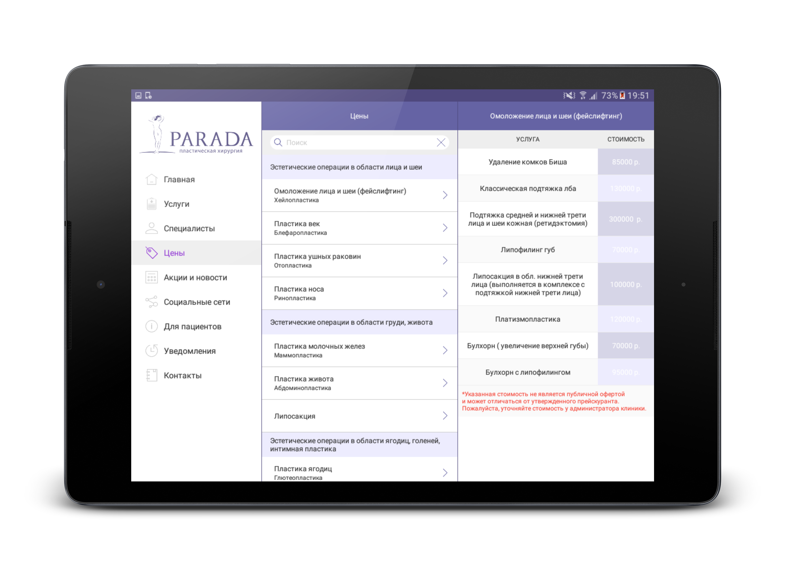

   

# ParadaAndroid
App for [paradaplastika.ru](http://paradaplastika.ru/)

## Architecture
- [MVP](https://github.com/StanleyProjects/ParadaAndroid/tree/master/java/ru/parada/app/contracts) - MVP architecture
- [DAO](https://github.com/StanleyProjects/ParadaAndroid/blob/master/java/ru/parada/app/db/DAO.java) - DAO layer
- [DI](https://github.com/StanleyProjects/ParadaAndroid/tree/master/java/ru/parada/app/di) - DI architecture
- [Connection](https://github.com/StanleyProjects/ParadaAndroid/tree/master/java/ru/parada/app/connection) - Connection system for REST
- [Image cache](https://github.com/StanleyProjects/ParadaAndroid/blob/master/java/ru/parada/app/utils/IUtil.java) - Image cache system
- [Navigation Drawer](https://github.com/StanleyProjects/ParadaAndroid/blob/master/java/ru/parada/app/units/DrawerContainer.java) - custom Navigation Drawer

## Screenshots

 

 

# Build information
## defaultConfig
	applicationId "ru.parada.app"
	versionBase 1611270230
	versionCode 1804091654
	versionName "0.965"
## dependencies
	com.android.support:support-fragment:25.0.1
	com.android.support:recyclerview-v7:25.0.1
	com.google.firebase:firebase-messaging:9.8.0
	com.google.android.gms:play-services-maps:9.8.0
## gradle
    3.1.0
## google-services
    3.0.0